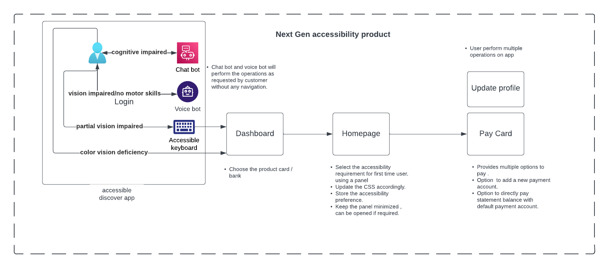
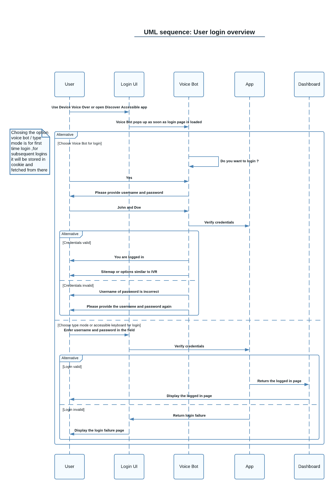
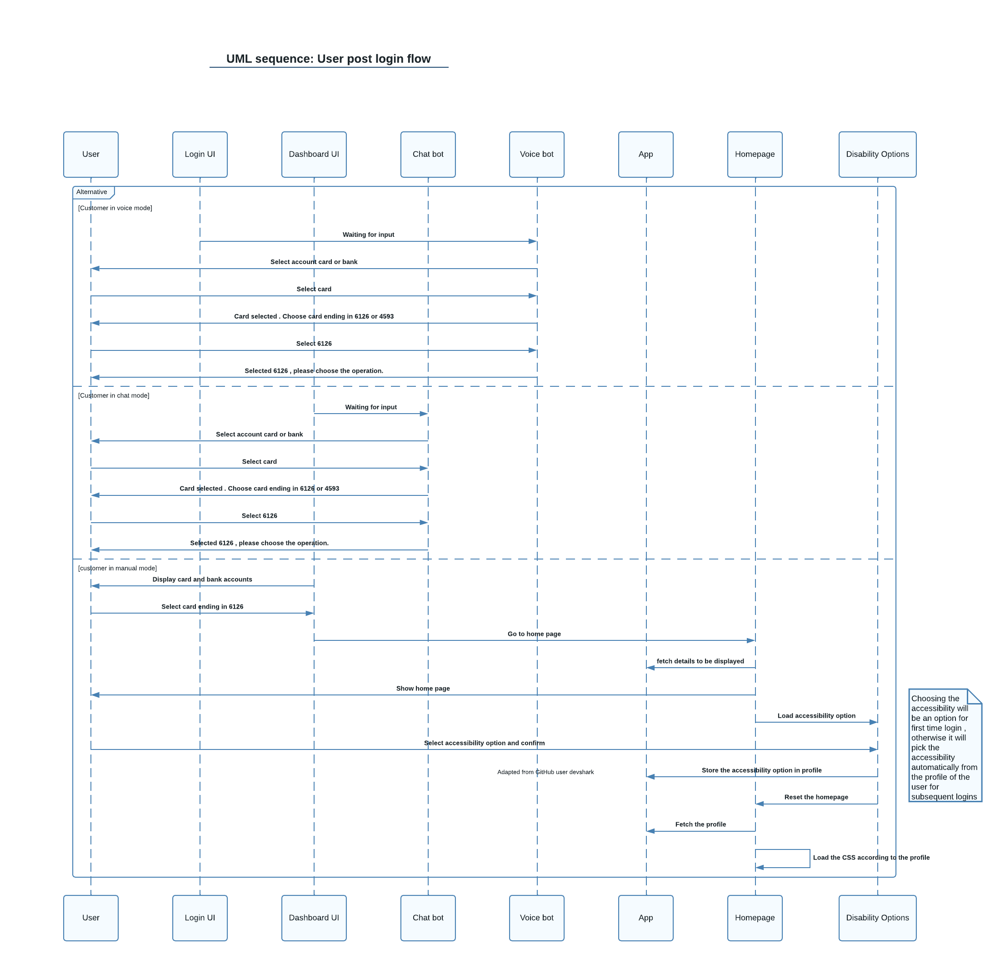
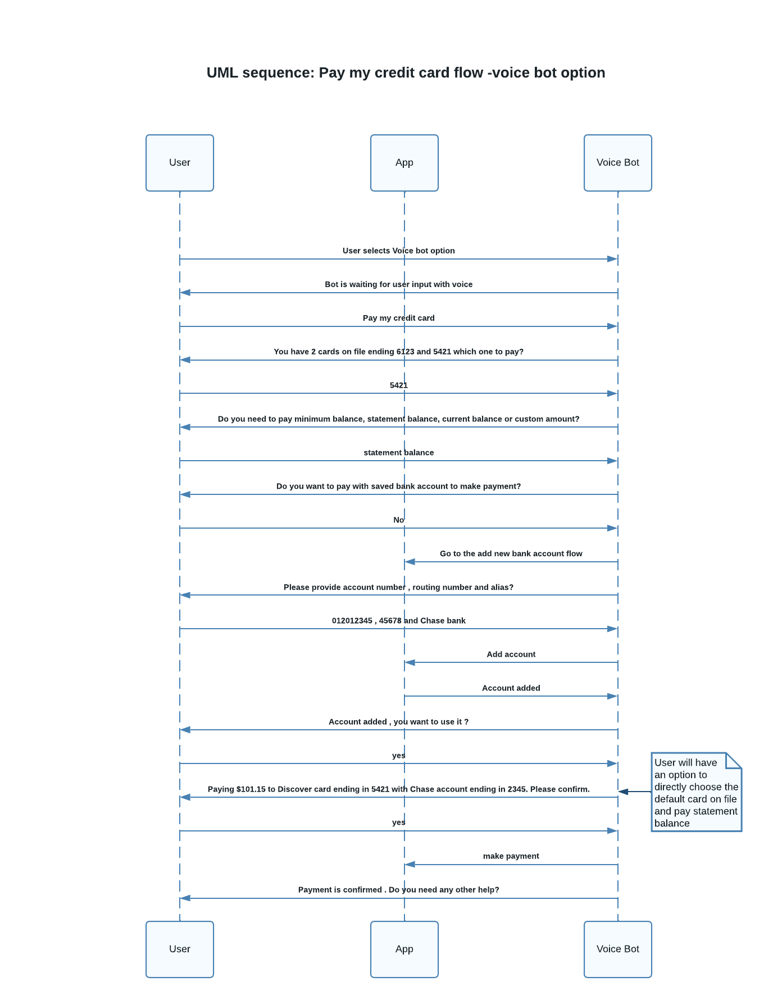
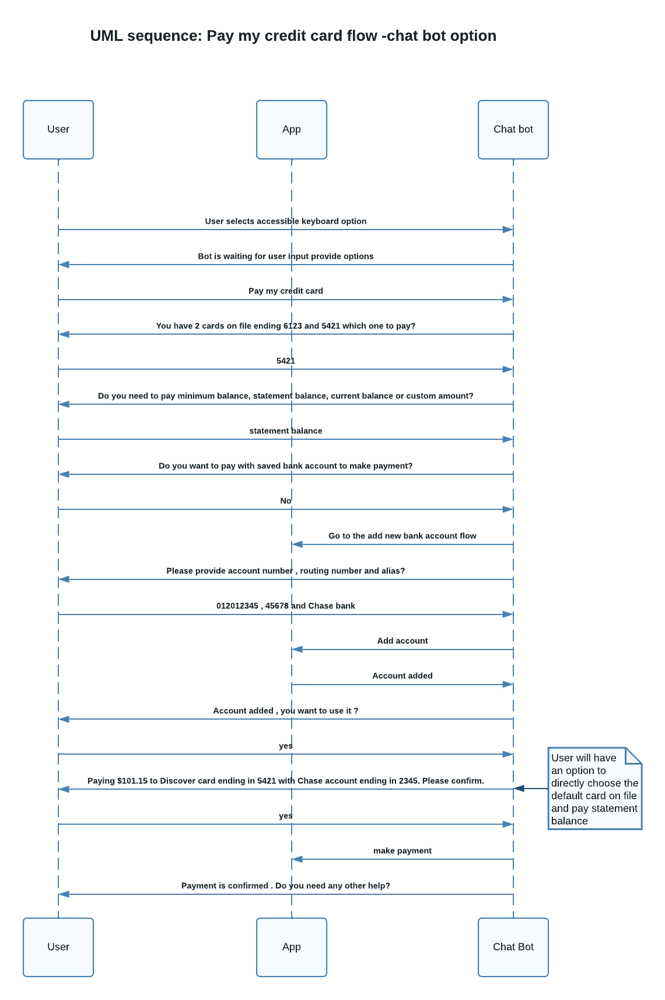
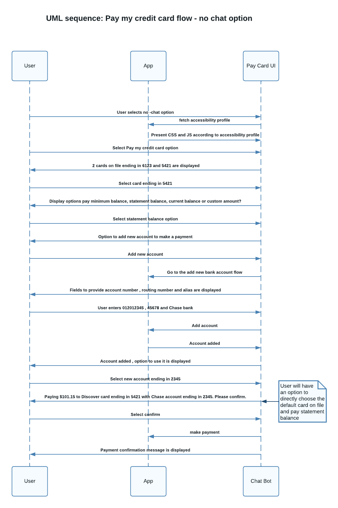

# Next Gen Accessibility product

#### Table of Contents
- [Next Gen Accessibility](#use-case-story-title) 
      - [Table of Contents](#table-of-contents)

  - [Business Challenge](#business-challenge)
    - [Concept](#concept)
    - [Approach](#approach)
  - [Story](#story)
  - [Demo Workflow](#demo-workflow)
    - [Login](#login)
    - [Post Login](#Post-Login)
    - [Pay Card with Voice bot](#Pay-Card-with-Voice-bot)
    - [Pay Card with Chat bot](#Pay-Card-with-Chat-bot)
    - [Pay Card with Manual](#Pay-Card-with-Manual)

 
## Business Challenge

 Impaired persons feel difficulties in navigating through the websites or mobile apps. Challenge is to address the accessibility requirements for Impaired persons on a finance institution's website while providing a seemless user experience with different tools. 
### Concept

 The concept of providing a URL (accessibility.discover.com) or an accessibility app which mirrors discover website functionality along with accessibility features with the product Next Gen Accessibility. This product will provide multiple tools like voice bot , chat bot, accessible keyboard and accessibility options panel to the impaired users so that they can get a seemless experience in the website without any difficulties.
### Approach

 

## Story

_Below story show how a visually impaired banking customer perform a specific task with the help of accessible chatbot._

## Demo Workflow

 
### Login
 

### Post Login
 

### Pay Card with Voice bot
 

### Pay Card with Chat bot
 

### Pay Card with Manual
 

 
 
